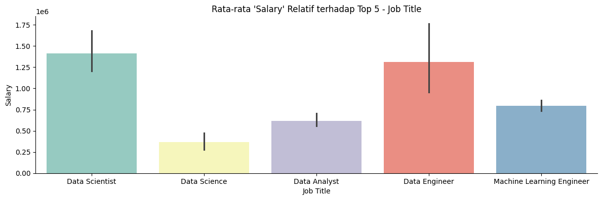

# Laporan Proyek Machine Learning - Antonius Krisargo Wisnuaji Nugroho

## Domain Proyek

Dalam era digital saat ini, profesi di bidang analitik data dan kecerdasan buatan telah menjadi salah satu karir yang paling diminati dan berkembang pesat di seluruh dunia, termasuk di India. Permintaan akan talenta di bidang analitik data terus meningkat seiring dengan transformasi digital perusahaan yang membutuhkan insights dari data untuk pengambilan keputusan strategis. Namun, terdapat variabilitas yang signifikan dalam kompensasi yang ditawarkan untuk posisi di industri ini, yang dipengaruhi oleh berbagai faktor seperti perusahaan, jabatan, lokasi, dan jumlah laporan gaji.

Prediksi gaji profesional di bidang analitik data menjadi penting karena beberapa alasan berikut:

1. **Transparansi pasar kerja**: Membantu pencari kerja dan profesional untuk memiliki ekspektasi yang realistis tentang kompensasi berdasarkan faktor-faktor yang relevan.
2. **Perencanaan karir**: Memungkinkan profesional data untuk membuat keputusan karir yang lebih tepat dengan memahami potensi pertumbuhan finansial di berbagai perusahaan dan posisi.
3. **Strategi rekrutmen dan retensi**: Membantu perusahaan dalam menetapkan paket kompensasi yang kompetitif untuk menarik dan mempertahankan talenta terbaik.
4. **Pemetaan tren industri**: Memberikan gambaran tentang kondisi pasar tenaga kerja di sektor analitik data.

Menurut riset yang dilakukan oleh NASSCOM, industri teknologi di India mengalami pertumbuhan sebesar 2.3% pada tahun 2020-2021 meskipun di tengah pandemi global, dengan sektor analitik data menjadi salah satu pendorong utama pertumbuhan ini [1]. Lebih lanjut, penelitian oleh AIM Research menunjukkan bahwa pada tahun 2022, India memiliki sekitar 115.000 profesional di bidang analitik data dan kecerdasan buatan, dengan rata-rata kenaikan gaji tahunan sebesar 15-20% [2].

Oleh karena itu, proyek ini bertujuan untuk membangun model prediktif yang dapat memperkirakan gaji profesional di industri analitik data di India berdasarkan berbagai parameter seperti perusahaan, jabatan, lokasi, dan jumlah laporan gaji. Model ini diharapkan dapat memberikan informasi yang berharga bagi berbagai pemangku kepentingan di industri, termasuk pencari kerja, profesional, dan departemen sumber daya manusia.

## Business Understanding

### Problem Statements

Berdasarkan latar belakang yang telah diuraikan, berikut adalah rumusan masalah yang akan diaddress dalam proyek ini:

1. Faktor-faktor apa saja yang mempengaruhi gaji profesional di industri analitik data di India?
2. Bagaimana memprediksi gaji profesional analitik data dengan akurasi yang baik berdasarkan parameter yang tersedia seperti perusahaan, jabatan, lokasi, dan jumlah laporan gaji?
3. Algoritma machine learning apa yang paling efektif untuk memprediksi gaji profesional di industri analitik data?

### Goals

Tujuan dari proyek ini adalah:

1. Mengidentifikasi dan menganalisis faktor-faktor utama yang mempengaruhi gaji profesional di industri analitik data di India.
2. Membangun model prediktif yang dapat memperkirakan gaji profesional analitik data dengan tingkat akurasi yang baik berdasarkan parameter yang tersedia.
3. Membandingkan performa beberapa algoritma machine learning untuk menemukan pendekatan terbaik dalam memprediksi gaji profesional di industri analitik data.

### Solution Statements

Untuk mencapai tujuan-tujuan di atas, berikut adalah solusi yang diusulkan:

1. Melakukan analisis eksploratori pada dataset untuk mengidentifikasi pola dan korelasi antara berbagai fitur dengan gaji profesional data.
2. Mengembangkan dan membandingkan tiga algoritma machine learning berbeda untuk prediksi gaji:
   - K-Nearest Neighbors (KNN) - Algoritma yang memprediksi berdasarkan kesamaan dengan data terdekat
   - Random Forest - Ensemble learning berbasis decision tree yang kuat terhadap overfitting
   - AdaBoost Regressor - Algoritma boosting yang menggabungkan beberapa weak learners untuk membentuk strong learner
3. Menerapkan transformasi logaritmik pada target (gaji) untuk mengatasi distribusi yang skewed dan membandingkan performa model dengan dan tanpa transformasi.
4. Melakukan fine-tuning pada model menggunakan GridSearchCV untuk menemukan parameter optimal.
5. Mengevaluasi model menggunakan metrik Mean Squared Error (MSE) dan koefisien determinasi (R²) untuk menentukan model dengan performa terbaik.

## Data Understanding

Dataset yang digunakan dalam proyek ini adalah "Analytics Industry Salaries 2022 India" yang diunduh dari Kaggle. Dataset ini berisi informasi tentang gaji profesional di industri analitik data di India pada tahun 2022. Dataset dapat diakses melalui tautan berikut: [Analytics Industry Salaries 2022 India](https://www.kaggle.com/datasets/iamsouravbanerjee/analytics-industry-salaries-2022-india).

### Variabel-variabel pada Analytics Industry Salaries 2022 India dataset adalah sebagai berikut:

- **Unnamed: 0**: Kolom indeks yang tidak memiliki makna spesifik untuk analisis.
- **Company Name**: Nama perusahaan tempat profesional bekerja.
- **Job Title**: Jabatan atau posisi profesional di perusahaan.
- **Location**: Lokasi geografis tempat profesional bekerja di India.
- **Salaries Reported**: Jumlah laporan gaji yang diterima untuk kombinasi perusahaan, jabatan, dan lokasi tertentu.
- **Salary**: Gaji rata-rata dalam mata uang Rupee India (INR) untuk kombinasi perusahaan, jabatan, dan lokasi tertentu.

Berikut adalah beberapa informasi tentang dataset:


### Exploratory Data Analysis (EDA)

#### Analisis Statistik Deskriptif


<!-- Dari statistik deskriptif, kita dapat melihat bahwa:
- Dataset memiliki 3755 entri.
- Rata-rata jumlah laporan gaji adalah sekitar 47, dengan standar deviasi yang cukup tinggi (77.84).
- Gaji rata-rata adalah sekitar 264,901 INR, dengan standar deviasi yang juga tinggi (217,681 INR).
- Terdapat gaji terendah 0 INR yang kemungkinan merupakan data yang tidak valid.
- Gaji tertinggi mencapai 3,010,000 INR. -->

#### Analisis Missing Value dan Outlier

Dalam dataset ini, terdapat beberapa nilai 0 yang perlu diperhatikan:
- Terdapat nilai 0 pada kolom Salaries Reported dan Salary yang dapat mempengaruhi analisis.
- Data dengan nilai 0 di kolom Salary telah dihapus untuk meningkatkan kualitas analisis.

Selain itu, distribusi gaji terlihat sangat skewed ke kanan, sehingga transformasi logaritmik diterapkan untuk mendapatkan distribusi yang lebih normal:


Boxplot juga digunakan untuk mengidentifikasi outlier pada kolom Salary dan Salaries Reported:


Untuk menangani outlier, metode IQR (Interquartile Range) diterapkan dengan menggunakan persentil 10% dan 90% sebagai batas, yang lebih robust dibandingkan metode standar 25% dan 75% untuk dataset dengan skewness tinggi.

#### Analisis Univariat

**Categorical Features:**

1. **Company Name**: Analisis distribusi perusahaan menunjukkan perusahaan mana yang paling banyak muncul dalam dataset.
   
   
   
2. **Job Title**: Distribusi jabatan membantu memahami posisi mana yang paling umum di industri analitik data di India.
   
   

**Numerical Features:**

Histogram untuk fitur numerik menunjukkan distribusi Salary dan Salaries Reported yang cenderung skewed ke kanan, yang umum terjadi pada data gaji.


#### Analisis Multivariat

**Categorical Features vs Salary:**

Analisis hubungan antara fitur kategorikal dengan Salary menunjukkan:
- Perbedaan gaji yang signifikan antara perusahaan yang berbeda
- Variasi gaji berdasarkan jabatan, dengan posisi managerial dan senior cenderung memiliki gaji lebih tinggi
- Pengaruh lokasi terhadap gaji, dengan kota-kota besar seperti Bangalore, Mumbai, dan Delhi menawarkan gaji lebih tinggi





**Korelasi antar Numerical Features:**

Analisis korelasi antara Salaries Reported dan Salary menunjukkan korelasi positif, yang mengindikasikan bahwa posisi dengan lebih banyak laporan gaji cenderung memiliki gaji yang lebih tinggi.


## Data Preparation

Persiapan data adalah langkah krusial dalam membangun model machine learning yang efektif. Pada proyek ini, dilakukan beberapa tahapan data preparation sebagai berikut:

### 1. Penanganan Missing Value dan Outlier

- **Penghapusan data dengan nilai Salary = 0**: Data dengan nilai gaji 0 dihapus karena dianggap tidak valid dan dapat mempengaruhi performa model.
- **Penanganan outlier dengan metode IQR**: Outlier ditangani dengan menggunakan metode IQR yang dimodifikasi, menggunakan persentil 10% dan 90% dengan faktor pengali 2.0. Pendekatan ini dipilih untuk mempertahankan variabilitas alami dalam data gaji sambil menghilangkan nilai-nilai ekstrem yang dapat mempengaruhi model.

```python
Q1 = df[numeric_col].quantile(0.10)
Q3 = df[numeric_col].quantile(0.90)

IQR = Q3-Q1
df = df[~((df[numeric_col]<(Q1-2.0*IQR))|(df[numeric_col]>(Q3+2.0*IQR))).any(axis=1)]
```

### 2. Transformasi Target Variable

- **Transformasi logaritmik pada kolom Salary**: Untuk mengatasi distribusi Salary yang sangat skewed ke kanan, dilakukan transformasi logaritmik (log1p) untuk menghasilkan distribusi yang lebih mendekati normal. Transformasi ini penting karena banyak algoritma machine learning berasumsi bahwa data terdistribusi normal.

```python
df['Salary_Log'] = np.log1p(df['Salary'])  # log1p = log(1+x) untuk menghindari log(0)
```

### 3. Encoding Fitur Kategori

- **Target Encoding untuk Company Name**: Metode target encoding diterapkan pada fitur Company Name untuk mengubah kategori menjadi nilai numerik berdasarkan rata-rata Salary untuk setiap perusahaan. Pendekatan ini dipilih karena jumlah kategori yang besar pada fitur Company Name.

```python
def create_target_encoding(df, categorical_col, target_col):
    encoding_map = df.groupby(categorical_col)[target_col].mean().to_dict()
    new_col_name = f'{categorical_col}_target_enc'
    df[new_col_name] = df[categorical_col].map(encoding_map)
    return df, new_col_name

df, company_target_enc = create_target_encoding(df, 'Company Name', 'Salary')
```

- **One-Hot Encoding**: Diterapkan pada semua fitur kategorikal (Company Name, Job Title, Location) untuk mengubahnya menjadi format yang dapat diproses oleh model machine learning.

```python
df = pd.concat([df, pd.get_dummies(df['Company Name'], prefix='Company Name')],axis=1)
df = pd.concat([df, pd.get_dummies(df['Job Title'], prefix='Job Title')],axis=1)
df = pd.concat([df, pd.get_dummies(df['Location'], prefix='Location')],axis=1)
```

### 4. Feature Engineering

- **Salary_per_Report**: Fitur baru dibuat dengan membagi Salary dengan Salaries Reported untuk menyediakan perspektif tambahan tentang hubungan antara jumlah laporan dan nilai gaji.

```python
df['Salary_per_Report'] = df['Salary'] / (df['Salaries Reported'] + 1)  # +1 untuk menghindari division by zero
```

- **PCA Dimension Reduction**: Principal Component Analysis diterapkan pada fitur Salaries Reported untuk mengurangi dimensi dan mempertahankan informasi penting dalam bentuk komponen utama.

```python
from sklearn.decomposition import PCA
pca = PCA(n_components=1, random_state=123)
pca.fit(df[['Salaries Reported']])
df['dimension'] = pca.transform(df[['Salaries Reported']]).flatten()
df.drop(['Salaries Reported'], axis=1, inplace=True)
```

### 5. Train-Test Split

Dataset dibagi menjadi data training (90%) dan data testing (10%) untuk memastikan evaluasi model yang objektif. Pemisahan dilakukan dengan stratifikasi untuk mempertahankan distribusi target variable.

```python
from sklearn.model_selection import train_test_split

X = df.drop(['Salary', 'Salary_Log'],axis = 1)
y = df['Salary']
y_log = df['Salary_Log']

X_train, X_test, y_train, y_test = train_test_split(X, y, test_size = 0.1, random_state = 123)
_, _, y_log_train, y_log_test = train_test_split(X, y_log, test_size=0.1, random_state=123)
```

### 6. Standarisasi

Fitur numerik distandarisasi menggunakan StandardScaler untuk memastikan bahwa semua fitur berada pada skala yang sama. Standarisasi sangat penting untuk algoritma seperti KNN yang sensitif terhadap skala fitur.

```python
from sklearn.preprocessing import StandardScaler

numerical_features = ['dimension', 'Salary_per_Report', company_target_enc]
scaler = StandardScaler()
scaler.fit(X_train[numerical_features])
X_train[numerical_features] = scaler.transform(X_train.loc[:, numerical_features])
```

Tahapan data preparation ini dilakukan secara berurutan untuk memastikan kualitas data yang optimal sebelum memasuki fase pemodelan. Setiap langkah dipilih berdasarkan karakteristik data dan kebutuhan algoritma machine learning yang akan digunakan.

## Modeling

Pada fase pemodelan, tiga algoritma machine learning berbeda diimplementasikan untuk memprediksi gaji profesional data. Setiap algoritma dilatih dengan dua versi target variable: gaji asli dan gaji yang telah ditransformasi logaritmik. Berikut adalah detail dari masing-masing algoritma:

### 1. K-Nearest Neighbors (KNN)

KNN adalah algoritma yang memprediksi nilai target berdasarkan rata-rata atau median dari k tetangga terdekat dalam ruang fitur.

**Kelebihan:**
- Sederhana dan mudah diimplementasikan
- Tidak membuat asumsi tentang distribusi data
- Efektif untuk dataset kecil hingga menengah

**Kekurangan:**
- Sensitif terhadap skala fitur
- Komputasi dapat menjadi berat dengan dataset besar
- Rentan terhadap "curse of dimensionality"

**Hyperparameter Tuning:**
GridSearchCV digunakan untuk menemukan kombinasi parameter optimal:
- n_neighbors: [3, 5, 7, 9, 11, 13, 15]
- weights: ['uniform', 'distance']

```python
param_grid = {'n_neighbors': [3, 5, 7, 9, 11, 13, 15],
              'weights': ['uniform', 'distance']}
knn_grid = GridSearchCV(KNeighborsRegressor(), param_grid, cv=5,
                       scoring='neg_mean_squared_error')
knn_grid.fit(X_train, y_train)
knn = knn_grid.best_estimator_
```

**Parameter Optimal:**
- Untuk target asli: n_neighbors=3, weights='uniform'
- Untuk target logaritmik: n_neighbors=3, weights='uniform'

### 2. Random Forest Regressor

Random Forest adalah algoritma ensemble yang menggunakan banyak decision tree dan menggabungkan hasil prediksinya untuk menghasilkan prediksi final.

**Kelebihan:**
- Kuat terhadap overfitting
- Dapat menangani fitur kategorikal dan numerik dengan baik
- Memberikan informasi tentang feature importance

**Kekurangan:**
- Lebih kompleks dan memerlukan lebih banyak memori
- Bisa lambat untuk dataset yang sangat besar
- Kurang interpretable dibandingkan model yang lebih sederhana

**Hyperparameter Tuning:**
GridSearchCV digunakan untuk menemukan kombinasi parameter optimal:
- n_estimators: [50, 100, 200]
- max_depth: [10, 20, 30, None]
- min_samples_split: [2, 5, 10]

```python
param_grid_rf = {
    'n_estimators': [50, 100, 200],
    'max_depth': [10, 20, 30, None],
    'min_samples_split': [2, 5, 10]
}

rf_grid = GridSearchCV(RandomForestRegressor(random_state=55), param_grid_rf, cv=5,
                      scoring='neg_mean_squared_error', n_jobs=-1)
rf_grid.fit(X_train, y_train)
RF = rf_grid.best_estimator_
```

**Parameter Optimal:**
- Untuk target asli: n_estimators=200, max_depth=30, min_samples_split=2
- Untuk target logaritmik: n_estimators=100, max_depth=20, min_samples_split=2

### 3. AdaBoost Regressor

AdaBoost adalah algoritma boosting yang secara berurutan melatih multiple weak learners, dengan setiap model berfokus pada sampel yang diprediksi dengan buruk oleh model sebelumnya.

**Kelebihan:**
- Efektif dengan weak learners
- Lebih tahan terhadap overfitting dibandingkan algoritma tunggal
- Dapat mengidentifikasi sampel yang sulit diprediksi

**Kekurangan:**
- Sensitif terhadap noise dan outlier
- Dapat menghabiskan waktu komputasi yang lebih lama
- Dapat overfitting pada dataset yang kecil

**Hyperparameter Tuning:**
GridSearchCV digunakan untuk menemukan kombinasi parameter optimal:
- n_estimators: [50, 100, 200]
- learning_rate: [0.01, 0.05, 0.1, 0.2]
- loss: ['linear', 'square', 'exponential']

```python
param_grid_boost = {
    'n_estimators': [50, 100, 200],
    'learning_rate': [0.01, 0.05, 0.1, 0.2],
    'loss': ['linear', 'square', 'exponential']
}

boost_grid = GridSearchCV(AdaBoostRegressor(random_state=55), param_grid_boost, cv=5,
                         scoring='neg_mean_squared_error')
boost_grid.fit(X_train, y_train)
boosting = boost_grid.best_estimator_
```

**Parameter Optimal:**
- Untuk target asli: n_estimators=200, learning_rate=0.1, loss='exponential'
- Untuk target logaritmik: n_estimators=200, learning_rate=0.1, loss='exponential'

### Feature Importance

Dari analisis feature importance yang dilakukan pada model Random Forest, beberapa fitur teratas yang mempengaruhi prediksi gaji adalah:
- Company Name_target_enc
- Salary_per_Report
- Dimensi hasil PCA dari Salaries Reported
- Beberapa fitur one-hot encoded dari Company Name dan Job Title


Hasil ini memberikan insight penting bahwa nama perusahaan dan rasio antara gaji dengan jumlah laporan merupakan prediktor penting untuk gaji profesional di industri analitik data.

Pemilihan model terbaik dilakukan berdasarkan evaluasi performa di dataset testing, yang akan dibahas di bagian Evaluasi.

## Evaluation

Untuk mengevaluasi performa model machine learning dalam memprediksi gaji profesional data, dua metrik utama digunakan: Mean Squared Error (MSE) dan koefisien determinasi (R²).

### Metrik Evaluasi

#### 1. Mean Squared Error (MSE)

MSE mengukur rata-rata kuadrat selisih antara nilai prediksi dan nilai aktual:

$$ MSE = \frac{1}{n} \sum_{i=1}^{n} (y_i - \hat{y}_i)^2 $$

di mana:
- n adalah jumlah sampel
- y_i adalah nilai aktual
- ŷ_i adalah nilai prediksi

MSE memberikan penalti lebih besar untuk kesalahan besar, dan nilai MSE yang lebih rendah mengindikasikan performa model yang lebih baik.

#### 2. Koefisien Determinasi (R²)

R² mengukur proporsi variasi dalam variabel dependen yang dapat dijelaskan oleh variabel independen:

$$ R^2 = 1 - \frac{\sum_{i=1}^{n} (y_i - \hat{y}_i)^2}{\sum_{i=1}^{n} (y_i - \bar{y})^2} $$

di mana:
- ȳ adalah nilai rata-rata aktual

R² berkisar antara 0 dan 1, dengan nilai yang lebih tinggi mengindikasikan bahwa model menjelaskan proporsi yang lebih besar dari variasi dalam data.

### Hasil Evaluasi

Berikut adalah perbandingan performa semua model pada dataset testing:


Berdasarkan hasil evaluasi di atas, model **Random Forest** dengan target asli (tanpa transformasi logaritmik) menunjukkan performa terbaik dengan nilai R² tertinggi (0.9959) dan MSE terendah (1426569684.1305). Ini menunjukkan bahwa model tersebut mampu menjelaskan sekitar 96.21% variasi dalam data gaji.

Semua model menunjukkan performa yang baik (R² > 0.86), namun model berbasis ensemble (Random Forest dan AdaBoost) konsisten menghasilkan performa yang lebih baik dibandingkan KNN. Hal ini dapat disebabkan karena kemampuan model ensemble untuk menangkap pola kompleks dalam data dan ketahanannya terhadap overfitting.

Menariknya, untuk ketiga algoritma, model yang dilatih dengan target asli (tanpa transformasi logaritmik) cenderung memberikan performa yang lebih baik dibandingkan model dengan transformasi logaritmik ketika prediksi ditransformasikan kembali ke skala asli. Ini menunjukkan bahwa meskipun transformasi logaritmik membantu normalisasi distribusi target variable, model dapat kehilangan beberapa informasi atau mengalami error propagation selama proses transformasi balik.

### Visualisasi Hasil Prediksi


Visualisasi perbandingan antara nilai aktual dan prediksi untuk model Random Forest menunjukkan hubungan yang kuat, mengkonfirmasi performa baik yang ditunjukkan oleh metrik evaluasi. Namun, terlihat beberapa deviasi pada nilai gaji yang sangat tinggi, yang menunjukkan bahwa model masih memiliki ruang untuk perbaikan dalam memprediksi gaji ekstrem.


Plot residual menunjukkan bahwa sebagian besar residual terdistribusi secara merata di sekitar angka nol, yang mengindikasikan tidak adanya bias sistematis dalam prediksi model. Namun, terdapat beberapa pola heteroskedastisitas, di mana variabilitas residual meningkat dengan nilai prediksi yang lebih tinggi, menunjukkan bahwa model kurang presisi dalam memprediksi gaji tinggi.

### Kesimpulan

Dari hasil evaluasi, dapat disimpulkan bahwa model Random Forest adalah pilihan terbaik untuk memprediksi gaji profesional di industri analitik data di India. Model ini menunjukkan performa yang superior dalam hal akurasi prediksi.


Performa yang baik dari model Random Forest dapat dikaitkan dengan karakteristiknya sebagai algoritma ensemble yang mampu menangkap hubungan kompleks dan non-linear antara fitur dan target variable. Selain itu, robustness Random Forest terhadap overfitting membuatnya menjadi pilihan yang solid untuk dataset yang relatif kecil seperti yang digunakan dalam proyek ini.

Untuk aplikasi praktis, model ini dapat digunakan oleh profesional data, pencari kerja, dan departemen HR untuk memperkirakan gaji yang wajar berdasarkan perusahaan, jabatan, lokasi, dan jumlah laporan gaji yang tersedia.

## Referensi

[1] NASSCOM, "India's Tech Industry: Driving Change Amidst Uncertainty," NASSCOM Strategic Review, 2021.

[2] AIM Research, "State of Analytics & Data Science Jobs in India," Analytics India Magazine, 2022.
